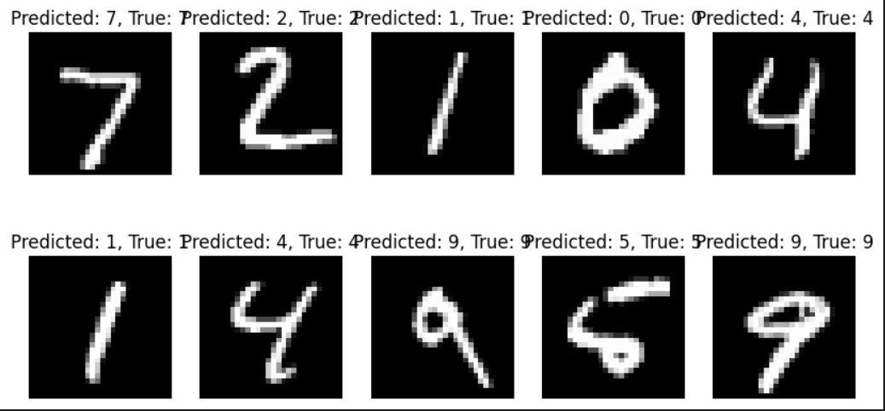
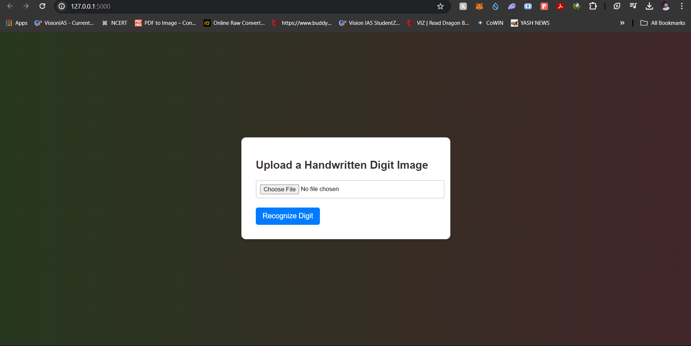
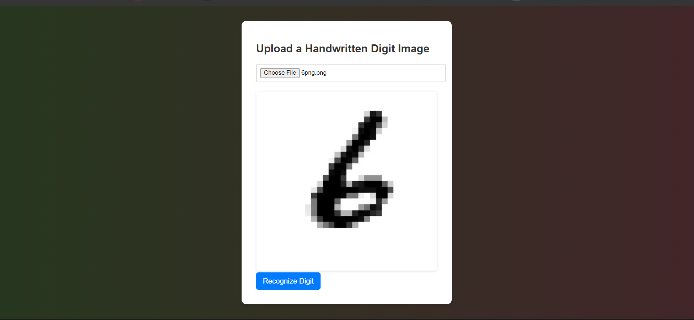
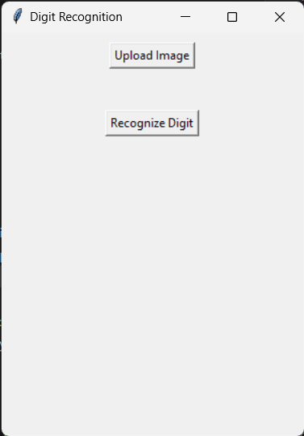
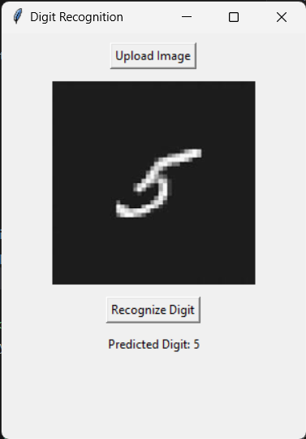

# Handwritten Digit Recognition using Convolutional Neural Network (CNN)

This project implements a Convolutional Neural Network (CNN) to classify handwritten digits from the MNIST dataset.

## Libraries Used:

- **TensorFlow**: Utilized for constructing and training the CNN model.
- **scikit-learn**: Employed for model evaluation and computation of metrics like accuracy, confusion matrix, and classification report.
- **matplotlib**: Utilized for data visualization.
- **tkinter**: Utilized for GUI development, including buttons, labels, and file dialogs.
- **PIL (Python Imaging Library)**: Utilized for image processing tasks such as opening, manipulating, and saving many different image file formats.
- **numpy**: Utilized for numerical computing and array manipulation tasks.
- **torch**: PyTorch library used for building and training neural networks.
- **torchvision**: PyTorch library providing utility functions and datasets for computer vision tasks.
- **flask**: Web framework used for building the web application for digit recognition.
- **io**: Input/output streams used for handling file-like objects.

## Data Preparation:

The MNIST dataset is accessed and loaded through the `mnist.load_data()` function from TensorFlow's Keras API. Subsequently, the data undergoes reshaping and normalization to conform to the CNN model's requirements.

The data processing segment of this project involves several key steps:

### 1. CNN Model Architecture:

The Convolutional Neural Network (CNN) model is defined with the following architecture:

- **Convolutional Layers**: Two convolutional layers with 32 and 64 filters respectively, each followed by a ReLU activation function and max-pooling operation.
- **Fully Connected Layers**: Two fully connected layers with 128 and 10 neurons respectively, suitable for multi-class classification.

### 2. Loading the MNIST Dataset:

The MNIST dataset is loaded using `torchvision.datasets.MNIST`. It includes training images of handwritten digits along with their respective labels.

### 3. Data Transformation:

The loaded dataset is transformed using `transforms.Compose`, which converts the images to tensors and normalizes their values.

### 4. Model Initialization:

An instance of the CNN model is initialized.

### 5. Loss Function and Optimizer:

The loss function used is Cross Entropy Loss (`nn.CrossEntropyLoss`), suitable for multi-class classification tasks. The Adam optimizer (`optim.Adam`) is utilized for model optimization.

### 6. Model Training:

The model is trained on the MNIST training set for a specified number of epochs. Each epoch involves iterating over batches of data, computing the loss, performing backpropagation, and updating the model parameters.

### 7. Monitoring Training Progress:

During training, the loss is calculated and displayed for each epoch. This provides insight into the model's convergence and performance over time.

### 8. Model Saving:

Once training is complete, the trained model's parameters are saved to a file named "mnist_cnn.pth" using `torch.save`.

## Model Architecture:

The CNN model architecture comprises two convolutional layers succeeded by max-pooling layers, a flattening layer, and two dense layers. The output layer comprises 10 neurons with softmax activation, facilitating multi-class classification.

## Model Training:

The model is compiled with appropriate loss function, optimizer, and evaluation metric settings. It undergoes training on the training data for 25 epochs with a 20% validation split.

## Model Evaluation:

1. **Accuracy**: Model accuracy is computed using scikit-learn's `accuracy_score` function.
2. **Confusion Matrix**: The confusion matrix is visualized using the `confusion_matrix` function from scikit-learn.
3. **Classification Report**: A comprehensive classification report encompassing precision, recall, F1-score, and support metrics is generated via the `classification_report` function from scikit-learn.

## Visualization:

1. **Training History**: Training and validation loss, as well as training and validation accuracy, are plotted across epochs using matplotlib.

2. **Example Predictions**: Several example predictions from the test set are showcased alongside their predicted and true labels.

## File Structure:

- `Digit_Recogniser.ipynb`: Jupyter Notebook containing the complete code.
- `Digit_Recogniser.py`: Python script housing the same code as in the notebook.
- `app.py`: Flask application code for digit recognition using the trained model.
- `generateModel.py`: Script for building the model for digit recognition.
- `templates`: Directory containing HTML templates for the Flask web application.
- `data`: Directory potentially storing the MNIST dataset.
- `build` and `dist`: Directories possibly associated with project build and distribution processes.

---
## Web application:
using Flask(app.py)
#### Screen_1

#### Screen_2

#### Screen_3

---
## Desktop application:
using tkinter and PIL libraries (Digit.py)
#### Screen_1

#### Screen_2
